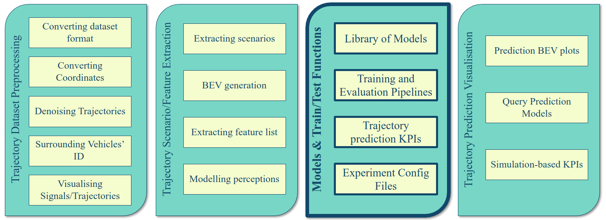

# Trajectory Prediction Models and Train/Test Functions 

This repo is part of Vehicle Trajectory Prediction Library (TPL): https://github.com/SajjadMzf/TPL



If you use any parts of this code, please cite us:
```
@article{mozaffari2023multimodal,
  title={Multimodal manoeuvre and trajectory prediction for automated driving on highways using transformer networks},
  author={Mozaffari, Sajjad and Sormoli, Mreza Alipour and Koufos, Konstantinos and Dianati, Mehrdad},
  journal={IEEE Robotics and Automation Letters},
  year={2023},
  publisher={IEEE}
}

@article{mozaffari2022early,
  title={Early lane change prediction for automated driving systems using multi-task attention-based convolutional neural networks},
  author={Mozaffari, Sajjad and Arnold, Eduardo and Dianati, Mehrdad and Fallah, Saber},
  journal={IEEE Transactions on Intelligent Vehicles},
  volume={7},
  number={3},
  pages={758--770},
  year={2022},
  publisher={IEEE}
}

```

## :gear: Installation
You may create a conda environment for this project using:
```shell
conda env create -f environment.yml
```


## :wave: Intro
This repository contains a library of trajectory prediction models and their training/evaluating/deploying functions. Following is a summary of implementations:

- A library of singlemodal/multimodal prediction models including: MMnTP[1], POVL[2] and their variants.
- Various singlemodal/multimodal trajectory prediction KPI implementation including: Min-RMSE-K, Min-FDE-K, MeanNLL.
- Experiment framework including config files for datasets, models, hyperparameters.
- Train, Evaluate, Transfer (transfer learning), and Deploy top level functions.


## :books: References:
1. Mozaffari, Sajjad, et al. "Multimodal manoeuvre and trajectory prediction for automated driving on highways using transformer networks." IEEE Robotics and Automation Letters (2023).

2. Mozaffari, Sajjad, et al. "Trajectory Prediction with Observations of Variable-Length for Motion Planning in Highway Merging scenarios." arXiv preprint arXiv:2306.05478 (2023).
